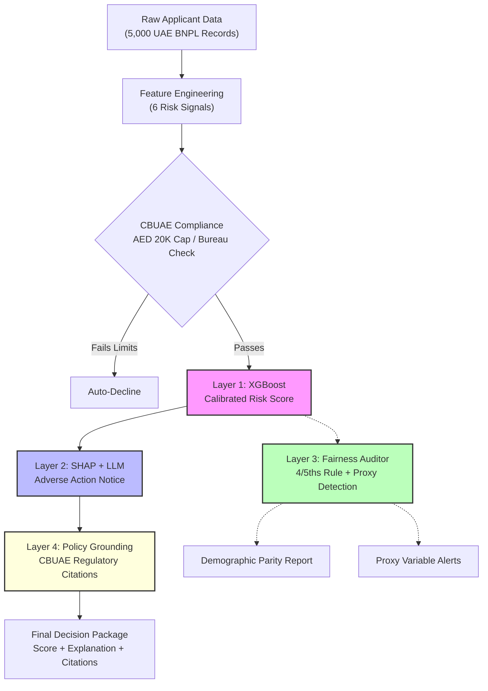

# ⚖️ AI Credit Decisioning Engine

[](https://www.python.org/downloads/)
[](#-test-suite)
[](https://xgboost.readthedocs.io/)
[](https://shap.readthedocs.io/)
[](https://groq.com/)
[](https://streamlit.io/)

A **4-Layer Hybrid ML + LLM Credit Decisioning Engine** built for the UAE BNPL market. Demonstrates how to deploy AI in a regulated financial environment where accuracy alone isn't enough — every decision must be explainable, fair, and grounded in regulation.

> **Portfolio Project** — Uses synthetic data. See [Scope Declaration](docs/PRD.md#scope-declaration).

---

## 🎯 The Problem

Standard ML credit scoring (XGBoost, LightGBM) is commoditized. The **hard problem** isn't scoring — it's explaining:

| Challenge | Why It Matters |
|-----------|---------------|
| ML outputs `P(default) = 0.73` | A compliance officer can't action a probability |
| SHAP values are for engineers | `feature_3 contributed -0.42` means nothing to a regulator |
| LLMs can hallucinate compliance claims | "Per CBUAE Article 5.2..." — is that even real? |
| Dropping protected classes ≠ fairness | Models learn proxy variables (age → tenure correlation) |

---

## 🏗️ The 4-Layer Architecture



| Layer | Component | What It Does |
|-------|-----------|-------------|
| **1** | XGBoost + Platt Scaling | Calibrated `P(default)` with `scale_pos_weight` for class imbalance |
| **2** | SHAP → Groq/Llama3 | Translates top SHAP factors into natural language Adverse Action Notices. **The LLM never decides — only explains.** |
| **3** | Fairness Auditor | 4/5ths rule (AIR ≥ 0.80), proxy variable detection (η² effect size), DataFrame-safe |
| **4** | Policy Grounder | Grounds every explanation in 14 curated CBUAE regulatory provisions via keyword retrieval |

---

## 🔑 Key Product Decisions

### 1. "Fairness Through Unawareness" Is Insufficient
We deliberately drop protected classes (`gender`, `nationality`, `age_group`) to demonstrate this common industry approach — then use Layer 3 to **prove it doesn't work**. The Fairness Auditor detects `employment_tenure_months` as a proxy for `age_group` via ANOVA with η² effect size, showing the model learns to discriminate through correlated features.

### 2. Bounding LLM Hallucinations
The LLM receives only the top SHAP factors (mathematically deterministic) and translates them into compliance language. If the LLM fails, the system falls back to template-based reason codes. Layer 4 then grounds the explanation in actual CBUAE regulations — never trusting the LLM's compliance claims.

### 3. Deterministic Keyword Retrieval for Policy (Not Vector RAG)
Layer 4 uses keyword-based retrieval over a curated 14-provision corpus instead of vector similarity search. Why? The regulatory surface area is bounded. Full semantic RAG is demonstrated in our [UAE Regulatory Compliance RAG Agent](https://github.com/Rick-developer/UAE-Regulatory-Compliance-RAG-Agent) — repeating it here adds no signal.

### 4. CBUAE Constraints as Hard Gates
Regulatory limits (AED 20,000 cap, bureau check > AED 5,000) are enforced in the data model and feature engineering — not learned from data. The model cannot override regulation.

---

## 📊 Triple-Evaluation Framework

| Dimension | Metric | Target |
|-----------|--------|--------|
| **ML Accuracy** | AUC-ROC, Gini, KS, Brier Score | AUC ≥ 0.80, Brier ≤ 0.15 |
| **Explanation Grounding** | SHAP Fidelity Rate | ≥ 95% of reason codes map to top SHAP features |
| **Portfolio Fairness** | Adverse Impact Ratio (4/5ths rule) | AIR ≥ 0.80 across all protected groups |

---

## 📁 Repository Structure

```
AI-Credit-Decisioning-Engine/
├── src/
│   ├── data/           # Pydantic models + synthetic data generator (5,000 records)
│   ├── features/       # 6 engineered risk signals (DTI, utilization, late payment freq)
│   ├── models/         # XGBoost scorer with SHAP, Platt calibration, save/load versioning
│   ├── explanations/   # Groq/Llama3 adverse action notice generator
│   ├── fairness/       # 4/5ths rule auditor + ANOVA proxy detection
│   ├── policy/         # Layer 4: CBUAE regulatory corpus + keyword grounder
│   └── evaluation/     # Triple evaluation framework
├── tests/              # 25 tests across all modules
├── docs/
│   ├── PRD.md                        # Product Requirements Document
│   ├── model_card.md                 # SR 11-7 compliant model card
│   └── monitoring_and_governance.md  # Production monitoring + data retention policy
├── app.py              # Streamlit dashboard (4 tabs: Score, Explain, Fairness, Policy)
└── .env.example        # Required API keys
```

---

## 🛠️ Quick Start

### Prerequisites
- Python 3.10+
- `GROQ_API_KEY` for LLM explanations (optional — mock mode available)

### Installation
```bash
git clone https://github.com/Rick-developer/AI-Credit-Decisioning-Engine.git
cd AI-Credit-Decisioning-Engine
python -m venv venv
source venv/bin/activate  # On Windows: venv\Scripts\activate
pip install -e ".[dev]"
```

### 1. Generate UAE Synthetic Data
```bash
python src/data/generator.py
# → 5,000 records with UAE demographics (88% expat, 12% Emirati)
```

### 2. Run the Test Suite
```bash
pytest tests/ -v
# → 25 tests covering scoring, explanations, fairness, policy grounding, versioning
```

### 3. Launch the Dashboard
```bash
cp .env.example .env
# Add your GROQ_API_KEY to .env (or use mock mode)
streamlit run app.py
```

---

## 📋 Documentation

| Document | Purpose |
|----------|---------|
| [PRD.md](docs/PRD.md) | Product requirements, personas, MoSCoW scope, architecture decisions |
| [model_card.md](docs/model_card.md) | SR 11-7 compliant model card: training data, features, fairness, limitations |
| [monitoring_and_governance.md](docs/monitoring_and_governance.md) | PSI drift detection, fairness monitoring, data retention (7-year), incident response |

---

## 🔒 Security

- Zero secrets in git history (verified across all commits)
- All API tokens loaded from `.env` via `python-dotenv`
- `.gitignore` excludes: `.env`, Notion scripts, model artifacts, generated data

---

## 🤝 Connect

**Gyana Pattnaik** — Data/Technical Product Manager specializing in AI architecture, ML systems, and regulatory compliance.

[LinkedIn](https://www.linkedin.com/in/gyana-pattnaik/) · [GitHub](https://github.com/Rick-developer) · [Portfolio](https://www.notion.so/Gyana-Pattnaik-AI-ML-Product-Portfolio-1cd3d24beaeb80c0b56bfc6a04dbd485)
